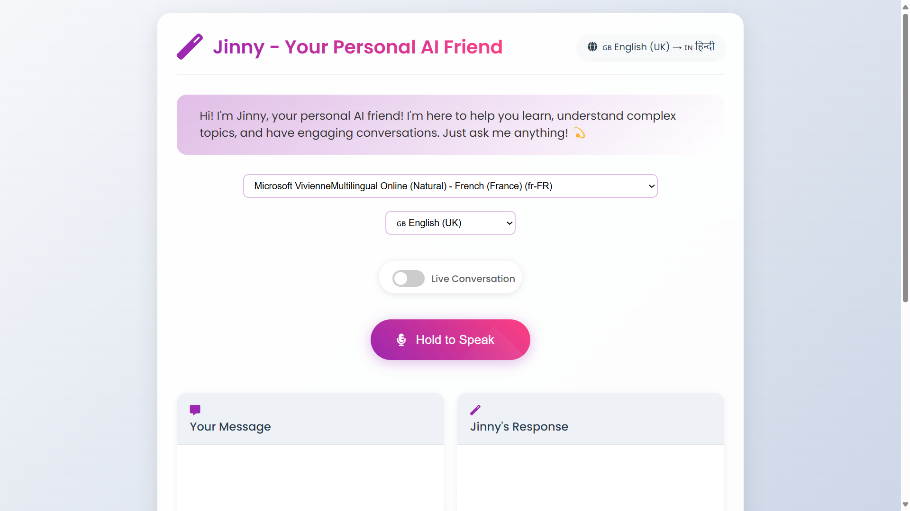

* 🤖 JINNY - Your Personal Voice Assistant & Learning Companion

Live : [https://jinny.onrender.com/](https://jinny.onrender.com/)

## Created by Gyana Ranjan

*Inspired by Iron Man's JARVIS*



## The Story Behind Jinny

As a devoted fan of Iron Man and his remarkable AI assistant JARVIS, I, Gyana Ranjan, always dreamed of creating an AI companion that could bring the same level of intelligence and personality to everyday interactions. This dream led to the birth of Jinny - an AI that doesn't just assist, but grows and evolves with you.

## Meet Jinny

Jinny isn't just another AI assistant - she's a personality with heart and soul who learns and adapts to you. Think of her as the friendly neighbor who's always ready to help, combined with the wit of a stand-up comedian and the knowledge of a scholar. The more you interact with Jinny, the better she understands your preferences, habits, and needs.

### Jinny's Unique Traits:

- 🧠 **Adaptive Learning**: Continuously learns from interactions to serve you better
- 👤 **Personal Growth**: Evolves her personality based on your preferences
- 🎯 **Memory**: Remembers your conversations and preferences
- 🗣️ **Conversationalist**: Loves engaging in meaningful conversations
- 🤔 **Curious Mind**: Always eager to learn and understand
- 🎯 **Helpful Nature**: Goes above and beyond to assist users
- 😄 **Humor**: Brings joy with her witty responses
- 🎵 **Musical**: Can sing and share songs to brighten your day
- 📚 **Storyteller**: Weaves engaging tales and narratives
- 🌟 **Proactive**: Anticipates needs before they're expressed
- 🎭 **Engaging**: Makes every interaction memorable
- 💝 **Soothing Presence**: Provides comfort and calm when needed

## How Jinny Learns About You

### Personalization Features:

- 📝 Conversation Memory: Maintains context from previous chats
- 🎵 Music Taste Learning: Remembers your favorite genres and songs
- 📅 Schedule Adaptation: Learns your daily routines and preferences
- 🗣️ Language Style Matching: Adapts communication style to match yours
- 🎨 Interest Tracking: Builds knowledge about your hobbies and interests
- 🔄 Behavioral Pattern Recognition: Understands and anticipates your needs

## Features

- Real-time conversation capabilities with memory retention
- Personalized story generation and narration
- Adaptive musical interactions and song performances
- Context-aware problem-solving assistance
- Entertainment and engagement tailored to your preferences
- Emotional support with personality development
- Learning and growth through each interaction

## Technical Stack

- Node.js
- Express.js
- OpenAI API
- WebSocket for real-time communication
- Natural Language Processing
- Speech Recognition & Synthesis

## Getting Started

1. Clone the repository

```bash
https://github.com/Gyana491/jinny.git
```

2. Install dependencies

```bash
npm install
```

3. Set up environment variables

```bash
# Create a .env file in the root directory and add:
OPENAI_API_KEY=your_api_key
```

4. Start the application

```bash
node server.js
```

5. Access Jinny

```
Open your browser and navigate to http://localhost:3000
```

## Contributing

1. Fork the repository
2. Create your feature branch (`git checkout -b feature/AmazingFeature`)
3. Commit your changes (`git commit -m 'Add some AmazingFeature'`)
4. Push to the branch (`git push origin feature/AmazingFeature`)
5. Open a Pull Request

## Future Enhancements

- 🧠 Advanced Personal Learning Algorithm
- 🎮 Interactive Games Integration
- 🌐 Multi-language Support
- 🎨 Customizable Personality
- 📱 Mobile App Development
- 🔊 Advanced Voice Recognition
- 🤝 Multi-user Interaction
- 📊 Personal Growth Analytics
- 🔄 Cross-Platform Memory Sync

## Support

For support, email [gyanaranjanmohanta2004@gmail.com](mailto:gyanaranjanmohanta2004@gmail.com)


## Acknowledgments

- Special thanks to the Iron Man franchise for the inspiration
- OpenAI for their amazing API
- The open-source community
- All contributors who help make Jinny better

## Connect With Me

- 🌐 Portfolio: [https://github.com/Gyana491](https://github.com/Gyana491)
- 💼 LinkedIn: [https://www.linkedin.com/in/mr-gyan491/]()
- 📧 Email: [gyanaranjanmohanta2004@gmail.com](mailto:gyanaranjanmohanta2004@gmail.com)

---

<div align="center">
Made with ❤️ by Gyana Ranjan
<br>
"Creating an AI companion that grows with you"
</div>
